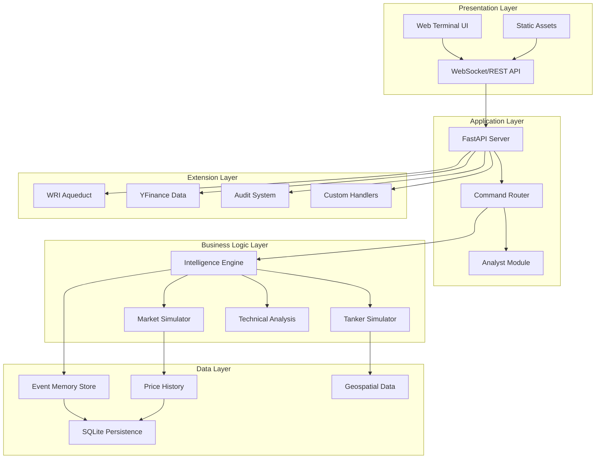
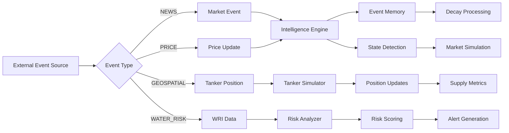

# FinanceX - Workflow Pipeline & Framework Layout

## 📋 Table of Contents
1. [System Overview](#system-overview)
2. [Architecture Framework](#architecture-framework)
3. [Data Flow Pipeline](#data-flow-pipeline)
4. [Module Breakdown](#module-breakdown)
5. [Workflow Pipelines](#workflow-pipelines)
6. [Extension System](#extension-system)
7. [API Architecture](#api-architecture)
8. [Development Workflow](#development-workflow)

---

## 🎯 System Overview

**FinanceX** is a real-time financial intelligence terminal that combines:
- Event-driven market analysis with memory decay
- Multi-asset price simulation and tracking
- Geospatial tanker tracking for commodity logistics
- WRI Aqueduct water risk integration
- LLM-powered analyst insights
- Real-time web terminal interface

### Core Philosophy
```
Events → Processing → State Detection → Market Simulation → Analysis → Visualization
```

---

## 🏗️ Architecture Framework

### Layer Architecture



### Directory Structure

```
FinanceX/
├── 📁 Core System
│   ├── main.py                    # CLI simulation entry point
│   ├── server.py                  # Basic FastAPI server
│   ├── server_enhanced.py         # Enhanced server with extensions
│   ├── engine.py                  # Intelligence Engine + Simulators
│   ├── analyst.py                 # LLM-powered analyst
│   ├── models.py                  # Core data models
│   └── test_engine.py             # Unit tests
│
├── 📁 extensions/                 # Modular extension system
│   ├── __init__.py                # Extension registry
│   ├── wri_aqueduct.py            # Water risk integration
│   ├── wri_models.py              # Water risk data models
│   ├── yfinance_data.py           # Real market data feed
│   ├── data_feeds.py              # Generic data feed handlers
│   ├── command_handlers.py        # Custom command processors
│   ├── enhanced_models.py         # Extended data models
│   ├── persistence.py             # Database operations
│   └── audit.py                   # Audit trail system
│
├── 📁 static/                     # Frontend assets
│   ├── index.html                 # Main terminal UI
│   ├── terminal.js                # Core terminal logic
│   ├── terminal_enhanced.js       # Enhanced features
│   ├── terminal.css               # Styling
│   ├── terminal_backup.css        # Backup styles
│   └── commodity_risk.js          # Commodity risk visualization
│
├── 📁 data/                       # Persistent data
│   └── market_data.db             # SQLite database
│
├── 📁 config/                     # Configuration files
│   └── [config files]
│
└── 📄 Configuration
    ├── requirements_extended.txt  # Python dependencies
    └── scriptl.js                 # Additional scripts
```

---

## 🔄 Data Flow Pipeline

### 1. Event Ingestion Pipeline



### 2. Processing Workflow

```
┌─────────────────────────────────────────────────────────────┐
│                    EVENT PROCESSING CYCLE                    │
└─────────────────────────────────────────────────────────────┘

Step 1: INGEST
   ├─ Receive MarketEvent
   ├─ Calculate relevance_score (base_impact × 1.0)
   ├─ Create ProcessedEvent
   └─ Add to engine.events[]

Step 2: DECAY
   ├─ For each event in memory:
   │  ├─ Calculate time_delta (hours since event)
   │  ├─ Apply exponential decay: weight = score × e^(-decay_rate × time)
   │  └─ Filter: keep only if weight > 0.5
   └─ Update engine.events[]

Step 3: STATE DETECTION
   ├─ Sum total_risk = Σ(event.current_weight)
   ├─ Determine SystemState:
   │  ├─ total_risk > 25.0  → CRASH
   │  ├─ total_risk > 15.0  → HIGH_VOLATILITY
   │  └─ total_risk < 5.0   → STABLE
   └─ Set MarketRegime (HIGH_VOL / LOW_VOL)

Step 4: MARKET SIMULATION
   ├─ Update all ticker prices based on system_risk
   ├─ Apply volatility multipliers:
   │  ├─ CRASH: 4.0x volatility, -2% bias
   │  ├─ HIGH_VOL: 2.0x volatility, -0.5% bias
   │  └─ STABLE: 0.8x volatility, +0.1% bias
   └─ Append to price history

Step 5: TANKER SIMULATION
   ├─ Adjust speed based on SystemState
   ├─ Update positions toward destinations
   ├─ Handle arrivals and rerouting
   └─ Calculate supply metrics

Step 6: SNAPSHOT CREATION
   ├─ Collect top 5 events by weight
   ├─ Package current state
   └─ Return MarketSnapshot
```

### 3. Command Processing Flow

```
User Input → FastAPI Endpoint → Command Router → Handler → Response Formatter → JSON → Frontend
                                      │
                                      ├─ TODAY → Event Log Query
                                      ├─ RISKS → State Detection
                                      ├─ QUOTE → Ticker Lookup
                                      ├─ CHART → Price History + Bollinger Bands
                                      ├─ ADVISE → Technical Analysis
                                      ├─ TANKERS → Geospatial Data
                                      ├─ NEWS → Filtered Event Feed
                                      └─ NEXT → Simulation Step
```

---

## 🧩 Module Breakdown

### Core Modules

#### 1. **models.py** - Data Models
```python
# Core Data Structures
├─ MarketEvent          # Raw event input
├─ ProcessedEvent       # Event with decay tracking
├─ SystemState (Enum)   # STABLE | HIGH_VOLATILITY | CRASH
├─ MarketRegime (Enum)  # LOW_VOL | HIGH_VOL
├─ MarketSnapshot       # Point-in-time system state
├─ Ticker               # Asset price tracking
├─ PricePoint           # Historical price data
├─ Tanker               # Vessel tracking
└─ GeoPoint             # Geographic coordinates
```

#### 2. **engine.py** - Intelligence Engine
```python
# Main Components
├─ IntelligenceEngine
│  ├─ ingest(event)              # Add new event
│  ├─ apply_decay(time)          # Age events
│  ├─ detect_state(time)         # Determine system state
│  ├─ get_ticker(symbol)         # Retrieve asset data
│  └─ get_all_tickers()          # Market overview
│
├─ MarketSimulator
│  ├─ tickers: Dict[str, Ticker] # 10 tracked assets
│  └─ update_prices(time, risk)  # Price evolution
│
├─ TankerSimulator
│  ├─ tankers: List[Tanker]      # 30 vessels
│  ├─ nodes: Dict[str, GeoPoint] # 7 major ports
│  ├─ update_positions(state)    # Movement logic
│  └─ get_supply_metrics()       # Logistics KPIs
│
└─ TechnicalAnalysis
   ├─ calculate_bollinger_bands() # Statistical bands
   └─ analyze_risk_depth()        # Trading signals
```

#### 3. **analyst.py** - LLM Integration
```python
# Analyst Module
├─ explain_situation(snapshot)   # Market narrative
├─ explain_event(event)          # Event analysis
└─ _mock_llm_response()          # Simulated LLM (placeholder for real LLM)
```

#### 4. **server.py / server_enhanced.py** - API Layer
```python
# FastAPI Endpoints
├─ POST /command                 # Command processor
├─ GET  /status                  # System state
├─ GET  /market                  # All tickers
└─ Static file serving           # Frontend assets
```

### Extension Modules

#### 5. **extensions/wri_aqueduct.py** - Water Risk
```python
# WRI Aqueduct Integration
├─ WaterRiskAnalyzer
│  ├─ analyze_port_risk()        # Port water stress
│  ├─ analyze_commodity_region() # Regional risk
│  └─ generate_alerts()          # Risk notifications
└─ Data models in wri_models.py
```

#### 6. **extensions/yfinance_data.py** - Real Data
```python
# Live Market Data Feed
├─ YFinanceDataFeed
│  ├─ fetch_real_time_data()     # Current prices
│  ├─ fetch_historical_data()    # Historical prices
│  └─ integrate_with_engine()    # Sync with simulator
```

#### 7. **extensions/persistence.py** - Database
```python
# SQLite Persistence Layer
├─ DatabaseManager
│  ├─ save_snapshot()            # Store state
│  ├─ load_history()             # Retrieve records
│  └─ export_data()              # Data export
```

#### 8. **extensions/audit.py** - Audit Trail
```python
# Audit System
├─ AuditLogger
│  ├─ log_command()              # Track user actions
│  ├─ log_state_change()         # State transitions
│  └─ generate_report()          # Audit reports
```

---

## 🔁 Workflow Pipelines

### Pipeline 1: Development & Testing

```bash
# 1. Environment Setup
python -m venv venv
source venv/bin/activate  # Windows: venv\Scripts\activate
pip install -r requirements_extended.txt

# 2. Run Unit Tests
python test_engine.py

# 3. CLI Simulation (Headless)
python main.py

# 4. Start Web Server (Development)
uvicorn server:app --reload --port 8000

# 5. Start Enhanced Server (Production-like)
uvicorn server_enhanced:app --reload --port 8000

# 6. Access Terminal
# Open browser: http://localhost:8000
```

### Pipeline 2: Real-Time Operation

```
┌─────────────────────────────────────────────────────────────┐
│              REAL-TIME OPERATION WORKFLOW                    │
└─────────────────────────────────────────────────────────────┘

[Server Start]
    ↓
[Initialize Engine]
    ├─ Load historical data from DB
    ├─ Initialize simulators
    └─ Seed initial events
    ↓
[Background Tasks] (Async)
    ├─ Auto-step simulation every 30s
    ├─ Fetch real market data (YFinance)
    ├─ Update WRI water risk data
    └─ Process decay continuously
    ↓
[User Interaction Loop]
    ├─ Receive command via /command endpoint
    ├─ Route to appropriate handler
    ├─ Execute deterministic logic
    ├─ Query LLM if needed (Analyst)
    ├─ Format response
    └─ Return JSON to frontend
    ↓
[Frontend Rendering]
    ├─ Parse response type
    ├─ Render appropriate component
    │  ├─ TABLE → Event log
    │  ├─ CHART → Price chart with Bollinger Bands
    │  ├─ MAP_DATA → Tanker positions
    │  ├─ REPORT → Risk analysis
    │  └─ TEXT → General output
    └─ Update terminal display
    ↓
[Persistence]
    ├─ Auto-save snapshots every 5 minutes
    ├─ Log all commands to audit trail
    └─ Export data on demand
```

### Pipeline 3: Data Integration

```
External Data Sources → Adapters → Engine → Storage
                                      ↓
                                  Analysis
                                      ↓
                                 Visualization

Data Sources:
├─ YFinance API          → Real market prices
├─ WRI Aqueduct API      → Water risk data
├─ Manual Events         → User-injected events
└─ Simulated Events      → Auto-generated scenarios

Adapters:
├─ yfinance_data.py      → Normalize to MarketEvent
├─ wri_aqueduct.py       → Convert to risk scores
└─ data_feeds.py         → Generic feed handler

Storage:
├─ In-Memory             → Active events (engine.events)
├─ SQLite                → Historical snapshots
└─ Export                → CSV/JSON for analysis
```

### Pipeline 4: Extension Development

```
1. Create Extension Module
   └─ extensions/my_extension.py

2. Define Data Models (if needed)
   └─ extensions/my_models.py

3. Implement Core Logic
   ├─ Data fetching
   ├─ Processing
   └─ Integration hooks

4. Register in __init__.py
   └─ Add to extension registry

5. Add Command Handler
   └─ extensions/command_handlers.py

6. Update Server
   └─ Import and mount in server_enhanced.py

7. Test Integration
   └─ Create test cases

8. Document
   └─ Update this file
```

---

## 🔌 Extension System

### Extension Architecture

```python
# extensions/__init__.py
EXTENSIONS = {
    'wri_aqueduct': {
        'enabled': True,
        'module': 'extensions.wri_aqueduct',
        'class': 'WaterRiskAnalyzer',
        'commands': ['WATER_RISK', 'PORT_RISK', 'COMMODITY_RISK']
    },
    'yfinance': {
        'enabled': True,
        'module': 'extensions.yfinance_data',
        'class': 'YFinanceDataFeed',
        'commands': ['LIVE_QUOTE', 'HISTORICAL']
    },
    'audit': {
        'enabled': True,
        'module': 'extensions.audit',
        'class': 'AuditLogger',
        'commands': ['AUDIT_LOG', 'AUDIT_REPORT']
    }
}
```

### Extension Lifecycle

```
Load → Initialize → Register Commands → Hook into Engine → Execute → Cleanup
```

### Creating Custom Extensions

```python
# Template: extensions/my_extension.py

from typing import Dict, Any
from models import MarketSnapshot

class MyExtension:
    def __init__(self, engine):
        self.engine = engine
        self.config = self._load_config()
    
    def _load_config(self) -> Dict:
        """Load extension configuration"""
        return {}
    
    def process_command(self, command: str, args: list) -> Dict[str, Any]:
        """Handle custom commands"""
        if command == "MY_COMMAND":
            return self._my_handler(args)
        return {"type": "ERROR", "content": "Unknown command"}
    
    def _my_handler(self, args: list) -> Dict[str, Any]:
        """Custom logic"""
        # Access engine state
        snapshot = self.engine.detect_state(self.engine.current_time)
        
        # Process data
        result = self._process(snapshot)
        
        # Return formatted response
        return {
            "type": "CUSTOM_TYPE",
            "title": "My Extension Output",
            "data": result
        }
    
    def _process(self, snapshot: MarketSnapshot) -> Any:
        """Core processing logic"""
        pass
    
    def on_state_change(self, old_state, new_state):
        """Hook for state transitions"""
        pass
    
    def cleanup(self):
        """Cleanup on shutdown"""
        pass
```

---

## 🌐 API Architecture

### REST Endpoints

| Method | Endpoint | Description | Response Type |
|--------|----------|-------------|---------------|
| POST | `/command` | Execute terminal command | JSON (varies by command) |
| GET | `/status` | Get current system state | `{time, state, risk, regime}` |
| GET | `/market` | Get all ticker data | Array of ticker objects |
| GET | `/` | Serve terminal UI | HTML |

### Command API Reference

```javascript
// Command Structure
POST /command
{
  "command": "COMMAND_NAME [ARGS]"
}

// Response Types
{
  "type": "TABLE" | "CHART" | "REPORT" | "TEXT" | "ERROR" | 
          "QUOTE" | "CHART_FULL" | "MAP_DATA" | "NEWS_FEED",
  "title": "Display Title",
  "data": { /* varies by type */ }
}
```

### Available Commands

```
Market Data:
├─ QUOTE <SYMBOL>      # Get current price and mini-chart
├─ CHART <SYMBOL>      # Full chart with Bollinger Bands
├─ ADVISE <SYMBOL>     # Technical analysis and trading advice
└─ SCAN                # System-wide market scan

Risk & Analysis:
├─ RISKS               # Current risk analysis
├─ TODAY               # Event log for current session
├─ MEMORY              # Memory decay visualization
├─ EVENT <ID>          # Detailed event analysis
└─ DISRUPTION          # Explain crash detection logic

Logistics:
├─ TANKERS             # Global tanker tracking map
└─ NEWS                # High-impact news feed

System:
├─ NEXT                # Advance simulation by 30 minutes
└─ HELP                # Command reference
```

### WebSocket Support (Future)

```javascript
// Planned for real-time updates
ws://localhost:8000/ws

// Message Types
{
  "type": "PRICE_UPDATE" | "STATE_CHANGE" | "NEW_EVENT" | "ALERT",
  "data": { /* event-specific data */ }
}
```

---

## 💻 Development Workflow

### Git Workflow

```bash
# Feature Development
git checkout -b feature/my-feature
# Make changes
git add .
git commit -m "feat: add my feature"
git push origin feature/my-feature
# Create PR

# Hotfix
git checkout -b hotfix/critical-bug
# Fix bug
git commit -m "fix: resolve critical bug"
git push origin hotfix/critical-bug
```

### Testing Strategy

```
Unit Tests (test_engine.py)
├─ Test event ingestion
├─ Test decay calculations
├─ Test state detection
├─ Test price simulation
└─ Test technical analysis

Integration Tests
├─ Test API endpoints
├─ Test command routing
├─ Test extension loading
└─ Test database operations

End-to-End Tests
├─ Test full simulation cycle
├─ Test frontend interactions
└─ Test real data integration
```

### Code Quality Checks

```bash
# Linting
flake8 *.py extensions/*.py

# Type Checking
mypy *.py

# Code Formatting
black *.py extensions/*.py

# Security Scan
bandit -r .
```

### Deployment Pipeline

```
Development → Testing → Staging → Production

1. Local Development
   └─ uvicorn server:app --reload

2. Testing Environment
   └─ Docker container with test data

3. Staging
   └─ Cloud deployment (AWS/GCP/Azure)
   └─ Load testing

4. Production
   └─ Multi-instance deployment
   └─ Load balancer
   └─ Monitoring & alerts
```

---

## 📊 Performance Optimization

### Caching Strategy

```python
# In-Memory Caching
├─ Active events (engine.events)
├─ Recent snapshots (last 100)
└─ Ticker price history (last 100 points)

# Database Caching
├─ Historical snapshots (older than 1 hour)
└─ Audit logs

# External Data Caching
├─ YFinance data (5-minute TTL)
└─ WRI data (24-hour TTL)
```

### Optimization Techniques

```
1. Event Memory Management
   └─ Auto-prune events with weight < 0.5

2. Price History Limiting
   └─ Keep only last 100 data points per ticker

3. Lazy Loading
   └─ Load extensions only when needed

4. Async Processing
   └─ Background tasks for data fetching

5. Database Indexing
   └─ Index on timestamp, symbol, event_type
```

---

## 🔐 Security Considerations

```
Authentication (Future)
├─ JWT tokens for API access
├─ Role-based access control
└─ Rate limiting

Data Protection
├─ Input validation on all commands
├─ SQL injection prevention (parameterized queries)
└─ XSS protection in frontend

Audit Trail
├─ Log all user actions
├─ Track state changes
└─ Monitor anomalies
```

---

## 📈 Monitoring & Observability

### Key Metrics

```
System Health:
├─ Active events count
├─ Memory usage
├─ API response times
└─ Error rates

Business Metrics:
├─ Commands processed per minute
├─ State transition frequency
├─ Average risk score
└─ Tanker movement efficiency

Data Quality:
├─ Event ingestion rate
├─ Data feed latency
└─ Cache hit ratio
```

### Logging Strategy

```python
# Log Levels
import logging

logging.info("Event ingested: {event}")
logging.warning("High risk detected: {risk_score}")
logging.error("Data feed failed: {error}")
logging.critical("System state: CRASH")
```

---

## 🚀 Future Enhancements

### Planned Features

```
1. Machine Learning Integration
   ├─ Predictive risk modeling
   ├─ Anomaly detection
   └─ Sentiment analysis from news

2. Advanced Visualizations
   ├─ 3D tanker tracking
   ├─ Heatmaps for risk zones
   └─ Interactive correlation matrices

3. Multi-User Support
   ├─ User accounts
   ├─ Shared watchlists
   └─ Collaborative analysis

4. Mobile App
   ├─ iOS/Android clients
   └─ Push notifications for alerts

5. Blockchain Integration
   ├─ Crypto market data
   └─ DeFi protocol tracking
```

---

## 📚 References

### Key Technologies

- **FastAPI**: Modern Python web framework
- **Pydantic**: Data validation
- **SQLite**: Embedded database
- **YFinance**: Market data API
- **WRI Aqueduct**: Water risk data

### Documentation Links

- FastAPI: https://fastapi.tiangolo.com/
- Pydantic: https://docs.pydantic.dev/
- YFinance: https://github.com/ranaroussi/yfinance
- WRI Aqueduct: https://www.wri.org/aqueduct

---

## 📝 Changelog

### Version History

```
v1.0.0 (Initial Release)
├─ Core intelligence engine
├─ Market simulation
├─ Tanker tracking
└─ Web terminal UI

v1.1.0 (Extensions)
├─ WRI Aqueduct integration
├─ YFinance real data
├─ Audit system
└─ Enhanced persistence

v1.2.0 (Planned)
├─ WebSocket support
├─ Advanced charting
└─ ML predictions
```

---

## 🤝 Contributing

### Contribution Guidelines

1. Fork the repository
2. Create a feature branch
3. Follow code style guidelines
4. Add tests for new features
5. Update documentation
6. Submit pull request

### Code Style

- Follow PEP 8 for Python
- Use type hints
- Document all functions
- Write descriptive commit messages

---

## 📄 License

[Specify your license here]

---

## 👥 Contact & Support

- **Project Lead**: [Your Name]
- **Email**: [Your Email]
- **Issues**: [GitHub Issues Link]
- **Discussions**: [GitHub Discussions Link]

---

*Last Updated: 2026-01-08*
*Document Version: 1.0*
